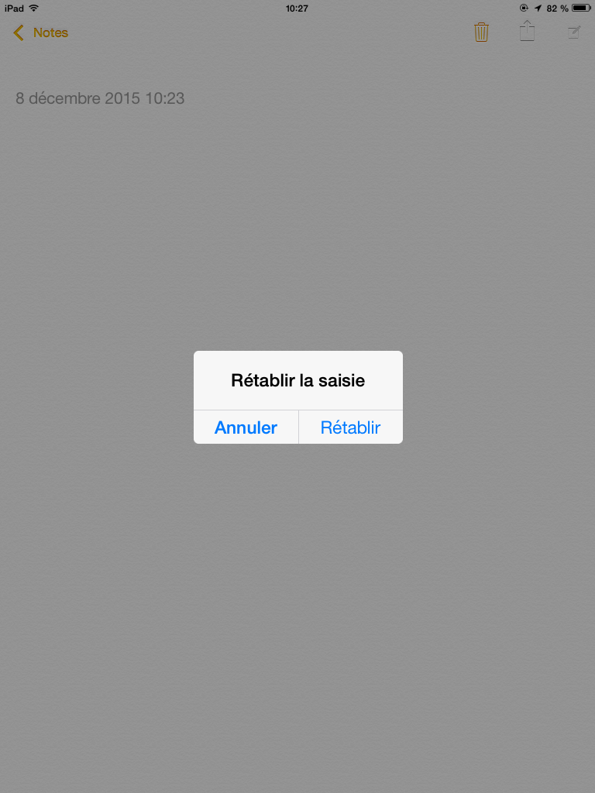

# Guide de conception d'applications mobiles accessibles

## Sommaire

  * [Sommaire](#sommaire)
  * [À qui s'adresse ce guide&nbsp;?](#%C3%A0-qui-sadresse-ce-guide&nbsp)
  * [Introduction](#introduction)
  * [Définir la cible](#d%C3%A9finir-la-cible)
    * [Note supplémentaire](#note-suppl%C3%A9mentaire)
  * [Avertissement](#avertissement)
  * [Recommandations](#recommandations)
    * [Système de navigation](#syst%C3%A8me-de-navigation)
    * [Design](#design)
      * [Information donnée par la couleur](#information-donn%C3%A9e-par-la-couleur)
        * [Ressources](#ressources)
      * [Contraste](#contraste)
        * [Ressources](#ressources-1)
      * [Tailles](#tailles)
        * [Ressources](#ressources-2)
      * [Marges](#marges)
        * [Ressource](#ressource)
      * [Orientation](#orientation)
        * [Ressource](#ressource-1)
    * [Décrire les éléments d'interface](#d%C3%A9crire-les-%C3%A9l%C3%A9ments-dinterface)
    * [Composants riches](#composants-riches)
        * [Ressource](#ressource-2)
    * [Formulaires](#formulaires)
      * [Les étiquettes de champ de formulaire](#les-%C3%A9tiquettes-de-champ-de-formulaire)
      * [Les types de champs de saisie](#les-types-de-champs-de-saisie)
      * [Ressource](#ressource-3)
    * [Capteur et alternative](#capteur-et-alternative)
    * [Geste et alternative](#geste-et-alternative)
      * [Ressources](#ressources-3)
  * [Notes techniques](#notes-techniques)
    * [Compatibilité des design patterns Aria avec le mobile](#compatibilit%C3%A9-des-design-patterns-aria-avec-le-mobile)
    * [Simplification des contrastes mobile](#simplification-des-contrastes-mobile)
  * [Ressources et références](#ressources-et-r%C3%A9f%C3%A9rences)
  * [Guides connexes](#guides-connexes)
  * [Licence](#licence)

## À qui s'adresse ce guide&nbsp;?

Ce guide présente les étapes à effectuer pour créer une application mobile accessible.
Le but est de définir les spécifications fonctionnelles avec les zonings, de définir l'ergonomie et la navigation dans l'application et de créer les maquettes pour fournir au développeur tous les éléments nécessaires à la création d'une application accessible.

Il s'adresse&nbsp;:
 - aux chefs de projets&nbsp;;
 - aux graphistes&nbsp;;
 - aux concepteurs en charge de la rédaction de spécifications techniques.

## Introduction

Pour créer une application mobile accessible, il est important de prendre en compte l'accessibilité dès le début de la conception de l'application.
Le contenu, le design et la navigation dans l'application doivent suivre certaines règles pour être accessibles au plus grand nombre d'utilisateurs quels que soient leurs handicaps.

Certains principes impactent directement les phases de zoning et la maquette de l'application, notamment concernant la couleur, la taille et les formulaires.

L'accessibilité est aussi confrontée aux lignes directrices des <abbr title="Operating System">OS</abbr> ciblés par l'application. En effet, pour ne pas perdre l'utilisateur et faciliter la compréhension et la navigation dans l'application, il est nécessaire de suivre ces lignes directrices. D'autant plus pour les applications iOS natives où Apple peut rejeter l'application du store si elles ne suivent pas les lignes directrices, notamment la 10.6 qui est dans le top 3 des causes de rejet par l'Apple store.

> 10.6 Apple et nos clients accordent beaucoup d’importance aux interfaces à haute valeur ajoutée, simples, raffinées, créatives et bien pensées. Ces dernières réclament plus de travail mais le valent vraiment. Apple place la barre haut. Si votre interface est trop complexe ou n’atteint le niveau d’excellence attendu, elle sera rejetée.

Nous verrons comment suivre les lignes directrices tout en rendant l'application accessible.

## Définir la cible

Avant de commencer, il est important de définir l'environnement cible de l'application.

Elle peut être de plusieurs natures&nbsp;:
 * Application Android native (Google Play)
 * Application iOS native (Apple Store)
 * Application hybride (Apple Store ou Google Play)
 * Application web mobile (web)

La cible étant définie, si la technologie est de nature <abbr title="Hypertext Markup Language">HTML</abbr>, les applications web mobiles et les applications hybrides devront suivre les [critères du <abbr title="Référentiel général d'accessibilité pour les administrations">RGAA</abbr> 3](http://references.modernisation.gouv.fr/rgaa/criteres.html) étendu par la [liste des critères spécifiques aux plateformes mobiles/tactiles](https://github.com/DISIC/referentiel-mobile-tactile/blob/master/refentiel-mobile-tactile-liste-criteres.md).

Pour les applications hybrides, qui ont un environnement très différent des applications web mobiles, nous vous invitons fortement à joindre dans les spécifications fonctionnelles le retour d'expérience sur les [frameworks hybrides](https://github.com/DISIC/guide-mobile_app_dev_hybride) Ionic et OnsenUI.

Pour les applications natives, en fonction de l'OS, les spécifications devront faire référence au guide ["Développer des applications accessibles avec les API Android et iOS"](https://github.com/DISIC/guide-mobile_app_dev_natif).

## Avertissement

Note : La liste des critères spécifiques aux plateformes mobiles/tactiles est une extension du référentiel RGAA 3. Elle n'a pas de caractère normatif du fait de l'hétérogénéité et de l'évolution des plateformes mobiles et du manque de référence normative WCAG. À ce titre, elle n'est pas insérée dans le référentiel lui-même mais proposée comme une simple ressource. Elle prend en charge uniquement les plateformes web, même si certains de ses critères peuvent être transposés sur un environnement applicatif. Dans ce document, elle est référencée comme la « thématique 14 », les critères sont numérotés 14.x

## Recommandations

### Système de navigation

Dans un premier temps, il est important de faire en sorte que la navigation soit intuitive pour tout les utilisateurs. La navigation doit être constituée de tâches simples avec un minimum d'étapes. La navigation sera bénéfique pour tous les utilisateurs.

Pour définir votre navigation sur Android et iOS vous pouvez suivre les [lignes directrices de Google](https://www.google.com/design/spec/patterns/navigation.html#navigation-defining-your-navigation) qui s'appliquent aussi bien à l'un ou l'autre des OS.
Lorsque la navigation sera définie, vous pouvez choisir le pattern le plus adapté à votre navigation.

Sous Android vous avez le choix entre plusieurs [types de navigation](https://www.google.com/design/spec/patterns/navigation.html#navigation-patterns)&nbsp;:
 * Tabs
 * Navigation drawer
 * Nested Navigation
 * Expanding navigation drawer
 * Gestural

Sous iOS les deux principaux [types de navigation](https://developer.apple.com/library/ios/documentation/UserExperience/Conceptual/MobileHIG/Navigation.html) sont&nbsp;:
 * Navigation Bar
 * Tab Bar

Si le menu est suffisament simple, moins de 4 éléments, les navigations Tabs sous iOS ou Tab Bar sous Android seront adaptés. Lorsque le menu contient plus de 4 éléments, il est nécessaire de passer sur une navigation plus élaborée (exemple : Navigation drawer ou Navigation Bar). En effet la taille minimun d'une zone sensible doit être de 9mm, limitant à 4 items horizontaux sur certain mobile.

Pour les applications web, il y a beaucoup plus de liberté pour créer le menu. Il est néanmoins nécessaire de respecter la thématique navigation du RGAA 3, notamment le [critère 12.2](http://references.modernisation.gouv.fr/rgaa/criteres.html#crit-12-2) et le [critère 12.3](http://references.modernisation.gouv.fr/rgaa/criteres.html#crit-12-3).

À ce stade, il est important de respecter [les tailles](#tailles), [les marges](#marges) et [le contraste](#contraste) dans la maquette du menu. De plus, pour les applications hybrides et pour le web mobile, il est important de vérifier que le [design pattern <abbr title="Accessible Rich Internet Applications">Aria</abbr> est compatible avec le mobile](#compatibilit-des-designs-patterns-aria-avec-le-mobile). En effet l'utilisation du pattern Menu et Menu Bar n'est actuellement pas possible en mobile web.

### Design

#### Information donnée par la couleur

Il est important de ne pas donner l'information uniquement par la couleur. Dans les exemples ci-dessous, il sera important d'ajouter une alternative textuelle à l'indication donnée par la couleur&nbsp;:
 * La saisie obligatoire des champs dans un formulaire lorsqu'ils sont en rouge
 * La page en cours de consultation dans un menu (couleur de fond de l'élément différente du menu)
 * L'indisponibilité d'un article indiquée par la couleur du texte
 * …

Lors de la conception de la maquette mobile, il est important d'annoter les éléments nécessitant une alternative textuelle. Le développeur aura ainsi, un moyen d'adapter en fonction de l'environnement cible, une alternative pour donner l'information donnée par la couleur.

##### Ressources

 * [Critère 3.1 [A] Dans chaque page Web, l'information ne doit pas être donnée uniquement par la couleur. Cette règle est-elle respectée ?](http://references.modernisation.gouv.fr/rgaa/criteres.html#crit-3-1)
 * [Critère 3.2 [A] Dans chaque page Web, l'information ne doit pas être donnée uniquement par la couleur. Cette règle est-elle implémentée de façon pertinente ?](http://references.modernisation.gouv.fr/rgaa/criteres.html#crit-3-2)

#### Contraste

Il est important d'utiliser des contrastes suffisamment élevés sur la maquette mobile. Pour être conforme RGAA 3, un contraste supérieur à 4,5:1 entre le texte et le fond sera requis. C'est une recommandation simplifiée du critère RGAA 3 (Voir la [Note technique](#simplification-des-contrastes-mobile)).
Lorsque la couleur est utilisée pour informer de la sélection en cours sur un onglet ou un menu, il est nécessaire que les couleurs de fond d'un item sélectionné ou non soient aussi d'un contraste supérieur à 4,5:1.

Google ajoute dans ses lignes directrices qu'il est préférable d'[utiliser de la transparence](https://www.google.com/design/spec/style/color.html#color-ui-color-application) pour les couleurs de textes noir ou blanc, plutôt que l'utilisation du gris. En effet, Google considère que le texte se détachera plus facilement en fonction du fond. Néanmoins le calcul de contraste peut se révéler plus ardu. L'outil en ligne [Contrast-Ratio](http://leaverou.github.io/contrast-ratio/#rgba%280%2C%200%2C%200%2C%200.6%29-on-white) permet de calculer le contraste entre un fond et un texte ayant une transparence (dans l'exemple un fond blanc et un texte noir avec une opacité de 0.6 obtiendra un ratio de 5,4:1).

##### Ressources

 * <a lang="en" href="https://www.google.com/design/spec/style/color.html">Material design - color</a>
 * <a lang="en" href="https://developer.apple.com/library/ios/documentation/UserExperience/Conceptual/MobileHIG/ColorImagesText.html">iOS Human Interface Guidelines - Color and Typography</a>

#### Tailles

Il n'est pas courant de spécifier la taille dans une maquette en millimètres. Néanmoins chaque zone sensible doit avoir une hauteur et une largeur supérieures à 9<abbr title="millimètres">mm</abbr> pour respecter le critère [14.1](https://github.com/DISIC/referentiel-mobile-tactile/blob/master/refentiel-mobile-tactile-liste-criteres.md#141-chaque-zone-sensible-a-t-elle-une-taille-suffisante).
Le développeur ne pourra pas prendre en compte directement une taille en millimètres au risque d'avoir un problème de performance pour le calcul par Android et un problème d'aliasing si la mesure tombe entre 2 pixels (voir exemple ci-dessous).

Il est nécessaire de prendre en compte la densité de pixels pour déterminer la taille réelle sur le support final.

Pour Android, la tâche peut se révéler assez complexe au vu du nombre de constructeurs et d'écrans différents. Il est possible de prendre [la grille de Google](https://design.google.com/devices/), cliquer sur un device pour obtenir les informations de la taille de zone sensible idéale. Il suffit de prendre la taille en densité de pixels pour une mesure de 9mm (exemple pour le mobile Android One qui sera de 51<abbr title="Density-independent pixels">dp</abbr>). Néanmoins, au vu du nombre important de devices et de densités de pixels différentes, une taille de zone sensible de 56dp aura quasiment toujours une taille supérieure à 9mm.

Sur iOS, la solution est plus simple au vu du nombre d’écrans différents. Une taille de 44 points est suffisante pour obtenir au moins 9mm.

Il est parfois compliqué de créer des boutons de 9mm de hauteur suivant la charte graphique. Néanmoins pour rendre accessible l’application, il est possible de faire déborder la taille de la zone sensible autour du bouton, pour obtenir la taille correcte. Il suffit juste d'annoter la maquette pour que le développeur ne fasse pas l’impasse sur cette adaptation.

##### Ressources

* <a lang="en" href="https://design.google.com/devices/">Google design - Device metrics</a>
* <a lang="en" href="https://developer.apple.com/library/ios/documentation/UserExperience/Conceptual/MobileHIG/LayoutandAppearance.html#//apple_ref/doc/uid/TP40006556-CH54-SW1">iOS Human Interface Guidelines - Adaptivity and Layout</a>

#### Marges

Pour rendre la maquette conforme, il est nécessaire d’ajouter des marges entre chaque zone sensible selon [la thématique 14](https://github.com/DISIC/referentiel-mobile-tactile/blob/master/refentiel-mobile-tactile-liste-criteres.md#141-chaque-zone-sensible-a-t-elle-une-taille-suffisante) du RGAA 3. Pour simplifier la démarche, nous vous conseillons d’utiliser une marge d’au moins 8px entre chaque bouton, et d’au moins 1px pour les listes ou onglets dans l’application.

Selon iOS ou Android, l’utilisation de [diviseur](https://www.google.com/design/spec/components/dividers.html) dans les listes est laissé à l'appréciation du graphiste. Néanmoins, s'il est nécessaire de ne pas en mettre. Il est préférable d'annoter la maquette pour éviter tout oubli de marge entre les items.

##### Ressource
<a lang="en" href="https://www.google.com/design/spec/components/dividers.html">Material design - Dividers</a>

#### Orientation

Lors de la création des maquettes, il est important que le contenu soit consultable dans les deux orientations, portrait et paysage. Il ne faut surtout pas restreindre le contenu en fonction de l'orientation de l'écran.

##### Ressource
[Critère 14.7 L'accès au contenu ne doit pas dépendre d'une orientation de l'écran (portrait ou paysage), cette règle est-elle respectée ?](https://github.com/DISIC/referentiel-mobile-tactile/blob/master/refentiel-mobile-tactile-liste-criteres.md#147-laccès-au-contenu-ne-doit-pas-dépendre-dune-orientation-de-lécran-portrait-ou-paysage-cette-règle-est-elle-respectée)

### Décrire les éléments d'interface

Lors de la spécification de l’application, les concepteurs doivent définir l'ensemble du vocabulaire nécessaire pour la navigation dans l’application, vocabulaire qui sera utilisé ultérieurement par l'équipe de développement. Il en va de même pour toutes les images, boutons images et icônes.

Il est important d'annoter directement la maquette avec les alternatives textuelles sur l'ensemble des images. De plus, chaque abréviation devra être renseignée. Créer un lexique à l’attention du développeur permettra de formaliser chaque abréviation utilisée dans l’application.

### Composants riches

Pour réaliser l’application, il est préférable d’utiliser les composants par défaut de la plateforme. Il sera tout de même nécessaire de faire des adaptations d’accessibilité pour certains composants.

Voir la liste des composants incompatibles sous&nbsp;:
 * <a lang="en" href="https://github.com/DISIC/guide-mobile_app_dev_natif/blob/master/api_android/android.md#widgets-incompatibles">Android</a>
 * <a lang="en" href="https://github.com/DISIC/guide-mobile_app_dev_natif/blob/master/api_ios/ios.md#widgets-incompatibles">iOS</a>

Pour le web, il est préférable d’utiliser en priorité des composants simples plutôt que l’<abbr lang="en" title="Application programming interface">API</abbr> Aria. Pour le mobile certains patterns Aria ne sont pas encore adaptés aux événements touch, il est important de [vérifier la compatibilité](#compatibilit-des-designs-patterns-aria-avec-le-mobile) lors du choix du composant.

En utilisant des composants natifs, l’application en sera plus robuste et plus simple à maintenir. Néanmoins, il est parfois nécessaire d’utiliser des composants plus complexes pour les besoins d’une application. Si l’on souhaite utiliser des vues personnalisées dans l’application, il est important de spécifier leur comportement au lecteur d’écran.

Il faut définir&nbsp;:
 * Le nom, le rôle, la valeur, l'état ; pour permettre au développeur d'adapter l'accessibilité à l'API selon l'environnement cible.
 * Le texte après le changement d’état.
 * La navigation au clavier.
 * Les sous zones focusables si nécessaire.
 * Les alternatives aux gestes complexes si nécessaire.

##### Ressource

[Critère 7.1 [A] Chaque script est-il, si nécessaire, compatible avec les technologies d'assistance ?](http://references.modernisation.gouv.fr/rgaa/criteres.html#crit-7-1)

### Formulaires

La création de formulaire dans une application mobile doit suivre la thématique 11 du RGAA 3.
Il y a quelques précautions à prendre pour le mobile et certaines erreurs à éviter lors de la conception de l'application.

#### Les étiquettes de champ de formulaire

L'étiquette doit toujours être visible même si la saisie est en cours. Il ne faut pas utiliser les placeholders web ou iOS ou encore les hints sous Android pour remplacer l'utilisation d'une étiquette. En effet, un placeholder ne sera plus visible suite à la saisie d'un utilisateur, ne donnant plus aucune information sur la nature de la saisie.

#### Les types de champs de saisie

Pour chaque champ de saisie, il est nécessaire de spécifier le type en annotant la maquette avec l’un des types suivants&nbsp;:
 * texte
 * recherche
 * téléphone
 * url
 * email
 * mot de passe
 * date
 * heure
 * nombre
 * couleur
 * fichier et le type

Le développeur pourra adapter en fonction de la cible (Android, iOS, HTML) le type de champ de saisie.
De cette manière, un clavier numérique adapté sera proposé à l’utilisateur afin d’optimiser sa saisie.

#### Ressource

 * [Critère 14.8 Pour chaque champ de saisie, le format de saisie attendu est-il, si possible, associé à un type de saisie pertinent&nbsp;?](https://github.com/DISIC/referentiel-mobile-tactile/blob/master/refentiel-mobile-tactile-liste-criteres.md#148-pour-chaque-champ-de-saisie-le-format-de-saisie-attendu-est-il-si-possible-associé-à-un-type-de-saisie-pertinent)

### Capteur et alternative

Pour chaque capteur, il est important de préciser une alternative. Certains utilisateurs n’auront pas la capacité d'approcher le mobile du capteur NFC, ou de prendre en photo le QRCode, ou encore d’utiliser correctement l’accéléromètre.

Il est important de trouver une alternative en utilisant par exemple un champ de saisie avec un code pour le NFC ou le QRCode, ainsi l'utilisateur n'ayant pas la capacité de flasher le code pourra entrer un code permettant d'accéder au contenu. Pour les capteurs de pression sur l’écran, un menu alternatif doit permettre d'accéder aux mêmes fonctionnalités.

### Geste et alternative

Les surfaces tactiles introduisent de nouvelles possibilités de navigation et d'interaction avec une application grâce au geste.
Lors de la spécification de l'application, 2 critères sont importants à prendre en compte pour rendre l'application mobile accessible.

Le critère [14.4](https://github.com/DISIC/referentiel-mobile-tactile/blob/master/refentiel-mobile-tactile-liste-criteres.md#144-chaque-interaction-gestuelle-complexe-a-t-elle-une-alternative) implique d'ajouter une alternative non-gestuelle ou une gestuelle simplifiée sur les gestes complexes. Pour simplifier, on peut étendre cette pratique à l'ensemble des gestes. La façon la plus simple est en général d'ajouter une action alternative utilisant le tap (*touch* en anglais) via un bouton ou un menu secondaire.

Pour respecter le critère [14.6](https://github.com/DISIC/referentiel-mobile-tactile/blob/master/refentiel-mobile-tactile-liste-criteres.md#146-les-interactions-gestuelles-impliquant-un-changement-dorientation-de-lécran-basculement-rotation-secouement-ont-elles-une-alternative-hors-cas-particulier), il est nécessaire d'ajouter une alternative pour chaque geste impliquant un changement d'orientation de l'écran (basculement, rotation, secouement…). On peut citer notamment la ligne directrice d'Apple, permettant à l'utilisateur d'initier une annulation d'opération en secouant l'appareil.

Dans l'exemple ci-dessous, le geste permet à l'utilisateur d'annuler ou rétablir une saisie en secouant l'appareil. Néanmois il n'y a pas d'alternative, un bouton "Annuler" ou "Rétablir" dans la barre du haut aurait été une alternative acceptable pour rendre l'application accessible.

#### Ressources
 * [Liste des critères RGAA 3, spécifiques aux plateformes mobiles/tactiles](https://github.com/DISIC/referentiel-mobile-tactile/blob/master/refentiel-mobile-tactile-liste-criteres.md)
 * <a lang="en" href="https://developer.apple.com/library/ios/documentation/UserExperience/Conceptual/MobileHIG/UndoRedo.html#//apple_ref/doc/uid/TP40006556-CH47-SW1">iOS Human Interface Guidelines - Undo and Redo</a>
 * <a lang="en" href="https://design.google.com/articles/design-from-ios-to-android/#gestures">Design from iOS to Android (and Back Again) - Gestures</a>
 * <a lang="en" href="https://www.google.com/design/spec/patterns/gestures.html">Material design - Gestures</a>

## Notes techniques

### Compatibilité des design patterns Aria avec le mobile

Lors de la conception d'une application mobile web ou d'une application hybride, si l'on veut que l'application mobile soit accessible, il est impératif de vérifier la compatibilité du pattern Aria avec le mobile. En effet, certains patterns Aria nécessitent une utilisation du clavier qui n'a pas d'équivalent pour les interfaces tactiles. Par exemple, la navigation dans un treeview fonctionne majoritairement avec les flèches du clavier.

Il existe une [anomalie dans <abbr title="Web Accessibility Initiative - Accessible Rich Internet Applications">WAI-ARIA</abbr> (en anglais)](https://github.com/w3c/aria/issues/60) qui est actuellement en cours (12/2015).

Pour choisir le pattern Aria, il est nécessaire de vérifier sa compatibilité, suivant l'OS ciblé, en vérifiant dans [la liste (en anglais)](https://docs.google.com/spreadsheets/d/1gN9oRZPdrJxLDNtT6nVO4fn7E7sn1061L9Xl3__slZ4/edit). Par exemple le design pattern Menu et Slider n'est pour le moment pas compatible, tandis que le Tab Panel peut être implémenté correctement.

### Simplification des contrastes mobile

Le critère [3.3](http://references.modernisation.gouv.fr/rgaa/criteres.html#crit-3-3) permet d'utiliser 2 types de contraste en fonction de la taille de police et de l'effet de graisse. En mobile, il y a pas vraiment d'équivalent en fonction de la densité de pixel, de l'OS… On peut donc simplifier en prenant un contraste d'au moins 4,5:1 pour l'ensemble des textes.

## Ressources et références
 * <a lang="en" href="https://www.google.com/design/spec/material-design/introduction.html">Material design</a>
 * <a lang="en" href="https://developer.apple.com/library/ios/documentation/UserExperience/Conceptual/MobileHIG/index.html">iOS Human Interface Guidelines</a>
 * <a lang="en" href="http://developer.android.com/design/patterns/accessibility.html">Material design - Accessibility</a>
 * <a lang="en" href="https://design.google.com/articles/design-from-ios-to-android">Design from iOS to Android (and Back Again)</a>
 * <a lang="en" href="http://webdesign.tutsplus.com/articles/a-tale-of-two-platforms-designing-for-both-android-and-ios--cms-23616">A Tale of Two Platforms: Designing for Both Android and iOS</a>
 * <a lang="en" href="https://developer.apple.com/app-store/review/rejections/">iOS - Common App Rejections</a>
 * <a lang="en" href="https://developer.apple.com/app-store/review/guidelines/#user-interface">App Store Review Guidelines</a>
 * <a lang="en" href="http://www.funka.com/en/our-assignments/research-projects/archive---research-projects/mobile-accessibility-guidelines/">Funka - Mobile accessibility guidelines</a>

## Guides connexes

Les guides suivants peuvent être consultés en complément&nbsp;:

* [Guide d'audit d'applications mobiles](https://github.com/DISIC/guide-mobile_app_audit)
* [Guide de conception d'applications mobiles accessibles](https://github.com/DISIC/guide-mobile_app_conception)
* [Guide de développement d'applications mobiles accessibles avec les API Android et iOS](https://github.com/DISIC/guide-mobile_app_dev_natif)
* [Guide de développement d'applications mobiles hybrides accessibles avec Ionic et OnsenUI](https://github.com/DISIC/guide-mobile_app_dev_hybride)

## Licence
Ce document est la propriété du Secrétariat général à la modernisation de l'action publique français (<abbr title="Secrétariat général pour la modernisation de l'action publique">SGMAP</abbr>). Il est placé sous la [licence ouverte 1.0 ou ultérieure](https://www.etalab.gouv.fr/licence-ouverte-open-licence), équivalente à une licence <i lang="en">Creative Commons BY</i>. Pour indiquer la paternité, ajouter un lien vers la version originale du document disponible sur le [compte Github de la <abbr title="Direction interministérielle du numérique et des systèmes d’information et de communication">DInSIC</abbr>](https://github.com/DISIC).

