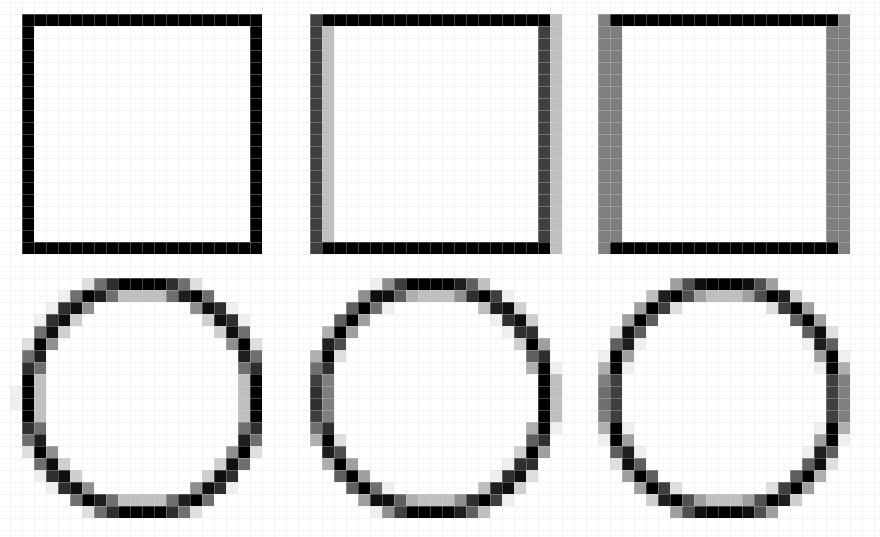
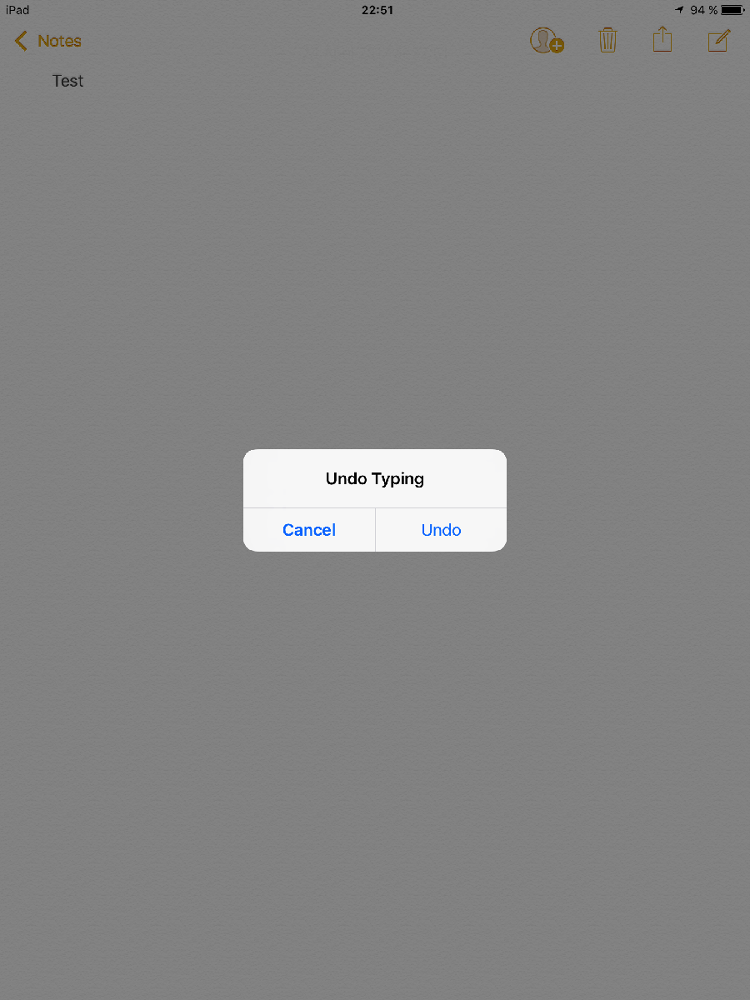

# Design Guide for Accessible Mobile Apps

## Table of contents

<!-- MarkdownTOC depth="3" -->

- [Who is this guide for?](#who-is-this-guide-for)
- [Introduction](#introduction)
- [Choose the target technology](#choose-the-target-technology)
- [Warning](#warning)
- [Recommendations](#recommendations)
  - [Navigation system](#navigation-system)
  - [Design](#design)
    - [Information conveyed through color](#information-conveyed-through-color)
    - [Contrast](#contrast)
    - [Sizes](#sizes)
    - [Spacing](#spacing)
    - [Orientation](#orientation)
  - [Describe interface elements](#describe-interface-elements)
  - [Rich interface components](#rich-interface-components)
  - [Forms](#forms)
    - [Form Field Labels](#form-field-labels)
    - [Types of input fields](#types-of-input-fields)
    - [Resource](#resource)
  - [Sensor and alternative](#sensor-and-alternative)
  - [Gesture and alternative](#gesture-and-alternative)
    - [Resources](#resources)
- [Technical Notes](#technical-notes)
  - [Compatibility of ARIA design patterns with mobile platforms](#compatibility-of-aria-design-patterns-with-mobile-platforms)
  - [Simplification of the contrast criteria on mobile devices](#simplification-of-the-contrast-criteria-on-mobile-devices)
- [Resources and References](#resources-and-references)
- [Related documents](#related-documents)
- [Licence](#licence)

<!-- /MarkdownTOC -->

## Who is this guide for?

This guide describes steps of the design process of an accessible mobile app.
The aim is to define the functional specifications with wireframes, to define the ergonomics and navigation in the app, and to create the templates to provide the developer with all the elements necessary to creating an accessible app.

It is intended for:
 - project managers;
 - graphic designers;
 - designers responsible for drafting technical specifications.

## Introduction

To create an accessible mobile app, it is important to consider accessibility from the start of the project.
Content, design and navigation in the app must follow certain rules to be accessible to the greatest number of users, regardless of their disabilities.

Some principles directly impact the wireframing phases and the app layout, including color, sizes, and forms.

Accessibility is also confronted with the targeted <abbr title = "Operating System">OS</abbr> guidelines. Indeed, in order to help the user understand and browse the app, it is necessary to follow these guidelines. Especially for iOS apps, since Apple can reject the app from store if it does not follow the guidelines, as stated in Apple's Common App Rejections page:

> Apple places a high value on clean, refined, and user-friendly interfaces. Make sure your UI meets these requirements by planning your design carefully and following our design guides and UI Design Dos and Don'ts.

We will see how to follow the guidelines while making the app accessible.

## Choose the target technology

Before you start, it is important to define the target environment for the app.

It can be of several types:
 * native Android app (Google Play)
 * native iOS app (Apple Store)
 * hybrid app (Apple Store or Google Play)
 * mobile web app

If the target technology is <abbr title="Hypertext Markup Language">HTML</abbr>, mobile web apps and hybrid apps must follow the [<abbr lang="fr" title = "Référentiel général d'accessibilité pour les administrations">RGAA</abbr> 3](https://disic.github.io/rgaa_referentiel_en/criteria.html) criteria, extended by the [list of criteria specific to mobile / tactile platforms](https://github.com/DISIC/referentiel-mobile-tactile/blob/en/mobile-touch-guidelines-criteria.md).

For hybrid apps, which have an environment very different from mobile web apps, we strongly advise you to consider our [feedback on the Ionic and OnsenUI hybrid frameworks](https://github.com/DISIC/guide-Mobile_app_dev_hybride/tree/english) when editing the functional specifications.

For native apps, depending on the OS, the specifications should refer to our guide ["Accessible mobile app development guides with Android and iOS APIs"](https://github.com/DISIC/guide-mobile_app_dev_native/tree/english).

## Warning

Note: The list of criteria specific to mobile/tactile platforms is an extension of the RGAA 3 reference list. At the time of writing, it is not normative because of the heterogeneity and evolution of the mobile platforms and the lack of WCAG normative reference. As such, it is not an integral part of the reference document itself, but proposed as an auxiliary resource. It supports only web platforms, although some of its criteria can be transposed into an app environment. In this document, it is referred to as "Category 14", the criteria are numbered 14.x.

## Recommendations

### Navigation system

First, it is important to ensure that navigation is intuitive for all users. The navigation should consist of simple tasks with a minimum of steps. Such navigation will be beneficial to all users.

To define your navigation for Android and iOS you can follow [Google guidelines](https://material.io/guidelines/patterns/navigation.html#navigation-patterns) that apply to both OS.
When navigation is defined, you can choose the pattern that best suits your app.

Under  Android you can choose between several [navigation patterns](https://material.io/guidelines/patterns/navigation.html#navigation-patterns):

 *  Embedded navigation
 *  Tabs
 *  Bottom navigation bar
 *  Navigation drawer
 *  Nested Navigation
 *  Expanding navigation drawer
 *  Gestural

The two main [navigation patterns on iOS](https://developer.apple.com/ios/human-interface-guidelines/ui-bars/navigation-bars/) are:

 *  Navigation Bar
 *  Tab Bar

If the menu is simple enough, comprising less than 4 items, Tabs  will be adapted. When the menu contains more than 4 items, it is necessary to switch to a more elaborate navigation (example:  Navigation drawer or  Navigation Bar). Indeed, the minimum size of a touch target must be 9 mm, limiting room to 4 horizontal items on some devices.

For web apps, there is much more freedom to create the menu. However, it is necessary to follow criteria of the navigation category of the RGAA 3, in particular [criterion 12.2](https://disic.github.io/rgaa_referentiel_en/criteria.html#crit-12-2) and [criterion 12.3](https://disic.github.io/rgaa_referentiel_en/criteria.html#crit-12-3).

At this point, it is important to follow recommendations on [sizes](#sizes), [spacing](#spacing) and [contrast](#contrast) in the menu design. In addition, for hybrid apps and mobile web apps, it is important to verify that the <abbr title="Accessible Rich Internet Applications">ARIA</abbr> design patterns are [compatible with mobile platforms](#compatibility-of-aria-design-patterns-with-mobile-platforms). In fact, at the time of writing, there are known issues regarding the support of ARIA design patterns by assistive tools on mobile platforms.

### Design

#### Information conveyed through color

Information must not be provided through color only. In the examples below, it will be necessary to add a textual alternative to the indication provided through color:

 * Mandatory fields in a form when they are in red
 * The current page in a navigation menu (change of background color for the current item)
 * The unavailability of an article indicated by the color of the text

When designing the mobile template, it is important to annotate elements requiring a textual alternative. The developer will thus be warned of the need to implement an alternative to color.

##### Resources

 * [Criterion 3.1 [A] On each Web page, information must not  be conveyed through color only. Has this rule been followed?](https://disic.github.io/rgaa_referentiel_en/criteria.html#crit-3-2)
 * [Criterion 3.2 [A] On each Web page, information  must not be conveyed through color only. Has this rule been implemented in a relevant way?](https://disic.github.io/rgaa_referentiel_en/criteria.html#crit-3-2)

#### Contrast

Sufficient contrast must be used in the app design. To be RGAA 3 compliant, a contrast higher than 4.5:1 between text and background will be required. This is a simplified version of the RGAA 3 criteria (See [Technical Note on contrast criteria](#simplification-of-the-contrast-criteria-on-mobile-devices)).
When the color is used to inform the user about current selection on a tab or menu, the contrast ratio between text and background colors must be higher than 4.5:1, regardless of the item selection status.

In their guidelines for material design, Google recommends to [use opacity](https://material.io/guidelines/style/color.html#color-usability) for black or white text colors, rather than using gray. They consider that the text will be more legible, and propose levels of opacity depending on the background color and expected effect. However, the calculation of contrast ratio may be more difficult when a degree of opacity is applied. The [Contrast-Ratio tool](http://leaverou.github.io/contrast-ratio/#rgba%280%2C%200%2C%200%2C%200.6%29-on-white) allows you to calculate the contrast ratio between a background and a text with an opacity value (in the example a white background and a black text with an opacity of 0.6 will get a ratio of 5.4:1).

##### Resources

 * <a href="https://material.io/guidelines/style/color.html">Material design - color</a>
 * <a href="https://developer.apple.com/ios/human-interface-guidelines/visual-design/color/">iOS Human Interface Guidelines - Color</a>

#### Sizes

It is not common to specify the size in millimeters in a template. However, each touch target must have a height and width greater than 9 <abbr title="millimeters">mm</abbr> to meet [criterion 14.1](https://github.com/DISIC/referentiel-mobile-tactile/blob/en/mobile-touch-guidelines-criteria.md#141-does-each-touch-target-have-a-sufficient-size).
The developer will not be able to directly take into account a size in millimeters; it would cause a performance issue with Android, and aliasing will affect measurement (see example below).

It is necessary to take into account the pixel density to determine the actual size on the end product.

For  Android, the task can be quite complex given the number of different manufacturers and screens. In [Google's device metrics grid](https://material.io/devices/), click a device to get information about the ideal touch size range. To obtain a size of 9 mm, take  the size in pixels (e.g. for the  Android One it will be 51 <abbr title = "Density-independent pixels">dp</abbr>). Nevertheless, given the large number of devices and different pixel densities, as a rule of thumb, a touch size of 56dp will almost always be larger than 9mm.

On  iOS, the solution is simpler given the number of different screens. A size of 44 point is sufficient to get at least 9 mm.

It is sometimes difficult to design buttons with a height of at least 9 mm, in certain interfaces. However, to make the app accessible, it is possible to have a touch target size larger than the visual boundaries of the button. To this end, it will be necessary to annotate the wireframe, to inform the developer of this adaptation.

##### Resources

* <a href="https://material.io/devices/">Material design - Device metrics</a>
* <a href="https://developer.apple.com/ios/human-interface-guidelines/visual-design/layout/">iOS Human Interface Guidelines - Layout</a>

#### Spacing

To design a UI that meets conformance requirements, it is necessary to have sufficient spacing between each touch target, according to [criterion 14.1](https://github.com/DISIC/referentiel-mobile-tactile/blob/en/mobile-touch-guidelines-criteria.md#141-does-each-touch-target-have-a-sufficient-size) of the RGAA 3. To simplify the process, we advise you to use a spacing of at least 8px between each button, and at least 1px for lists items or tabs in the app.

Either in iOS or Android, using [dividers](https://material.io/guidelines/components/dividers.html) in the lists is left to the discretion of the graphic designer. However, if dividers must not be used, it will be necessary to annotate the wireframe to avoid insufficient spacing between items.

##### Resource
<a href="https://material.io/guidelines/components/dividers.html">Material design - Dividers</a>

#### Orientation

Content must be available in both portrait and landscape orientations. Restricted access to content due to screen orientation can be a major barrier for some users with disabilities who cannot change the orientation of their device.

##### Resource
[14.7 Access to content should not depend on a screen orientation (portrait or landscape), has this rule been followed?](https://github.com/DISIC/referentiel-mobile-tactile/blob/en/mobile-touch-guidelines-criteria.md#147-access-to-content-should-not-depend-on-a-screen-orientation-portrait-or-landscape-has-this-rule-been-followed)

### Describe interface elements

When designing the app, designers must define the language used across the app, a vocabulary that will be used later by the development team. The same applies to all alternatives for images, image buttons and icons.

The wireframes must be annotated directly with the textual alternatives on all the images. In addition, each abbreviation must be developed. Creating a lexicon for the developer will help formalize each abbreviation used in the app.

### Rich interface components

To implement the app, it is preferable to use the default components of the platform. It will still be necessary to make adaptations for accessibility for certain components.

See the lists of incompatible components under:

 * <a href="https://github.com/DISIC/guide-mobile_app_dev_natif/blob/master/api_android/android.md#widgets-incompatibles">Android</a>
 * <a href="https://github.com/DISIC/guide-mobile_app_dev_natif/blob/master/api_ios/ios.md#widgets-incompatible">iOS</a>

For web apps, it is preferable to use simple components rather than those of the ARIA <abbr title = "Application programming interface"> API</abbr>. Some of the  ARIA design patterns are not yet adapted to touch events, it is important to [check compatibility](#compatibility-of-aria-design-patterns-with-mobile-platforms) when choosing the component.

By using native components, the app will be more robust and easier to maintain. However, it may be necessary to use more complex components for an app. If you want to use custom views in the app, it is important to specify their behavior to the screen reader.

You need to define:

 * Name, role, value, state, so that the developer can implement the accessibility adaptations relevant to the API of the target environment;
 * The text after the change of state;
 * Keyboard navigation;
 * Focusable sub-areas if necessary;
 * Alternatives to complex gestures if necessary.

##### Resource

[Criterion 7.1 [A] Does each script support assistive technologies, if necessary?](https://disic.github.io/rgaa_referentiel_en/criteria.html#crit-7-1)

### Forms

The design of forms in a mobile app must follow the criteria of [category 11](https://disic.github.io/rgaa_referentiel_en/criteria.html#formulaire) of the RGAA 3.
There are some precautions to take for the mobile and some errors to avoid when designing the app.

#### Form Field Labels

The label must always be visible even if input is in progress. The placeholders for web or iOS apps, or hints for Android, are no replacement for a label. Indeed, a placeholder will no longer be visible after user input, giving no more information about the expected input.

#### Types of input fields

For each input field, it is necessary to specify the type by annotating the wireframe with one of the following types:

 * Text
 * Search
 * Phone
 * Url
 * E-mail
 * Password
 * Date
 * Time
 * Number
 * Color
 * File, and type of file

The developer will then be able to choose the type of input field most adapted to the target (Android, iOS, or HTML).
Setting the appropriate field type will allow the OS to display the relevant on-screen keyboard, making the input easier for the user.

#### Resource

 * [14.8 For each input field, is the expected input format, if possible, associated with a relevant input type?](https://github.com/DISIC/referentiel-mobile-tactile/blob/en/mobile-touch-guidelines-criteria.md#148-for-each-input-field-is-the-expected-input-format-if-possible-associated-with-a-relevant-input-type)

### Sensor and alternative

For each sensor, it is important to specify an alternative. Some users will not have the ability to put their device close enough to a NFC sensor, or take a picture of a QRCode, or use the accelerometers efficiently.

An alternative must be found: for example, providing the option to input a code into a field, instead of making use of the NFC sensor, or of the camera to flash a QRCode. For pressure sensors on touch screen, an alternative menu must allow access to the same functionality.

### Gesture and alternative

Touch surfaces introduce new navigation possibilities of navigation and interaction with an app, thanks to gestures.
When specifying the app, 2 criteria must take into account to make the mobile app accessible.

The [criterion 14.4](https://github.com/DISIC/referentiel-mobile-tactile/blob/en/mobile-touch-guidelines-criteria.md#144-does-each-complex-gesture-based-interaction-have-an-alternative) involves adding a non-gestural alternative, or simplified gestures, to complex gestures. For more simplicity, this practice can be extended to all gestures. The easiest way is usually to add an alternative action using only single tap interactions, via a button or a secondary menu.

To meet [criterion 14.6](https://github.com/DISIC/referentiel-mobile-tactile/blob/en/mobile-touch-guidelines-criteria.md#146-do-gesture-based-interactions-involving-a-change-in-screen-orientation-tilting-rotation-shaking-have-an-alternative-except-in-particular-cases), it is necessary to add an alternative for each gesture involving a change of orientation (tilting, rotation, shaking...).

An example of such interaction can be found in Apple's guidelines: the user can undo an operation by shaking the device.
In the example below, the gesture allows the user to undo the last input by shaking the device. However, there is no alternative means to do this; an "Undo" button in the top bar would have been an acceptable alternative, to make the app accessible.

#### Resources

 * [List of criteria RGAA&nbsp;3, specific to mobile/tactile platforms](https://github.com/DISIC/referentiel-mobile-tactile/blob/en/mobile-touch-guidelines-criteria.md)
 * <a href="https://developer.apple.com/ios/human-interface-guidelines/interaction/undo-and-redo/">iOS Human Interface Guidelines - Undo and Redo</a>
 * <a href="https://design.google.com/articles/design-from-ios-to-android/"> Design from iOS to Android (and Back Again</a> - Gestures section
 * <a href="https://material.io/guidelines/patterns/gestures.html">Material design - Gestures</a>

## Technical Notes

### Compatibility of ARIA design patterns with mobile platforms

When designing a mobile web app or a hybrid app, if the app is to be accessible, it is imperative to check the compatibility of the ARIA design patterns with the device. Indeed, some  ARIA design patterns include keyboard interactions that have no equivalent with touch interfaces. For example, browsing in a treeview works mostly with the arrows keys on the keyboard.

There is a [gap in the ARIA specification](https://www.w3.org/TR/aria-in-html/#aria-touch) that is currently underway (as of April 2017).

Before selecting an  ARIA design pattern, it is necessary to verify its compatibility, depending on the target OS, by checking this [gap analysis (Google Sheets)](https://docs.google.com/spreadsheets/d/1gN9oRZPdrJxLDNtT6nVO4fn7E7sn1061L9Xl3__slZ4/edit). For example,  the Menu and  Slider design patterns  are currently not compatible, while Tab Panel can be made accessible.

### Simplification of the contrast criteria on mobile devices

The [criterion 3.3](https://disic.github.io/rgaa_referentiel_en/criteria.html#crit-3-3) sets 2 contrast ratios thresholds, depending on the font size and weight. On mobile devices, due to high variability in pixel densities and OS, this distinction is impractical. Therefore, the criterion is simplified to define 4.5:1 as the minimum contrast ratio for all texts.

## Resources and References

 * <a href="https://material.io/guidelines/material-design/introduction.html">Material design</a>
 * <a href="https://developer.apple.com/ios/human-interface-guidelines/overview/design-principles/">iOS Human Interface Guidelines</a>
 * <a href="https://material.io/guidelines/usability/accessibility.html">Material design - Accessibility</a>
 * <a href="https://design.google.com/articles/design-from-ios-to-android/">Design from iOS to Android (and Back Again)</a>
 * <a href="https://webdesign.tutsplus.com/articles/a-tale-of-two-platforms-designing-for-both-android-and-ios--cms-23616" >A Tale of Two Platforms: Designing for Both Android and iOS</a>
 * <a href="https://developer.apple.com/app-store/review/rejections/">iOS - Common App Rejections</a>
 * <a href="https://developer.apple.com/app-store/review/guidelines/#design">App Store Review Guidelines - Design</a>
 * <a href="http://www.funka.com/contentassets/9131835638b640cf96baf2ef62a2fba4/guidelines_for_the_development_of_accessible_mobile_interfaces.pdf">Funka's Guidelines for the development of accessible mobile interfaces (PDF, 270 kb)</a>

## Related documents

The following guides can be consulted in addition:

* [Mobile app audit guide](https://github.com/DISIC/guide-mobile_app_audit/tree/english)
* [Accessible mobile app development guides with Android and iOS APIs](https://github.com/DISIC/guide-mobile_app_dev_natif/tree/english)
* [Accessible hybrid mobile app development guide with Ionic and OnsenUI](https://github.com/DISIC/guide-mobile_app_dev_hybride/tree/english)

## Licence
This document is the property of the Secrétariat général à la modernisation de l'action publique (SGMAP). It is placed under [Open Licence 1.0 or later (PDF, 541 kb)](http://ddata.over-blog.com/xxxyyy/4/37/99/26/licence/Licence-Ouverte-Open-Licence-ENG.pdf), equivalent to a Creative Commons BY licence. To indicate authorship, add a link to the original version of the document available on the [DINSIC's GitHub account](https://github.com/DISIC).

